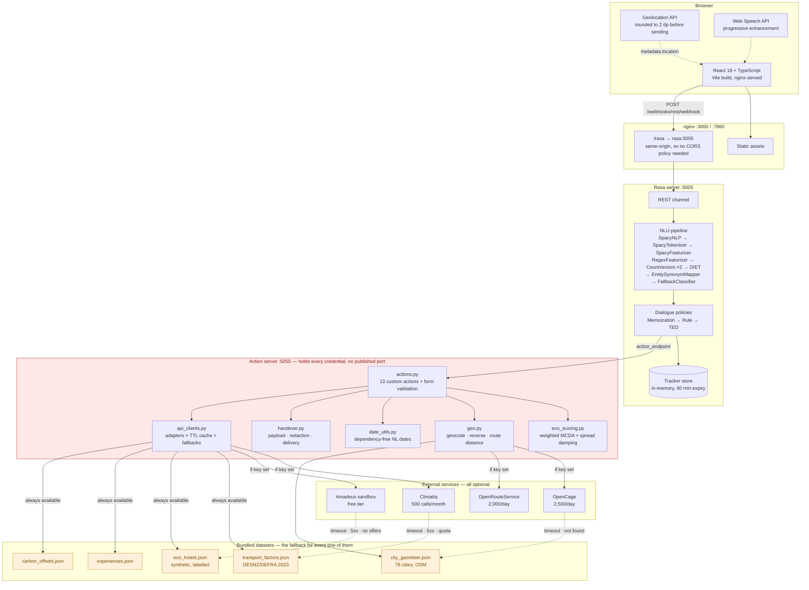
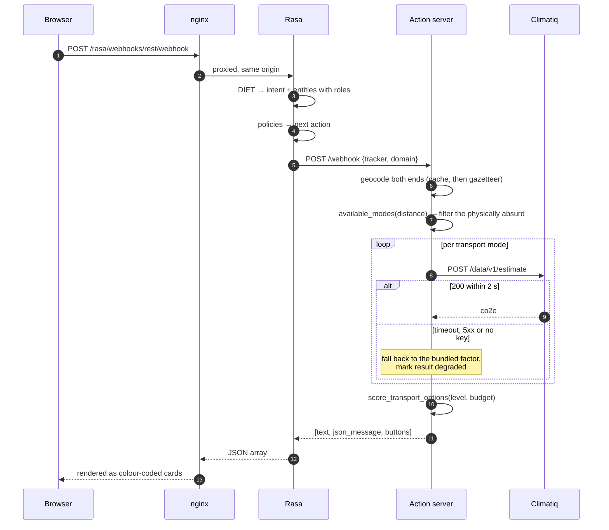

# System architecture

## Request path for one message

The loop is why `HTTP_TIMEOUT_SECONDS` defaults to 2.0 and why estimates are cached for 24
hours: a long-distance route offers up to eight modes, and eight sequential two-second
worst cases would blow the three-second response requirement several times over. In
practice the cache is warm after the first comparison of a given route, and a cold miss with
Climatiq down costs one timeout per mode before the offline factor answers instantly.

## Deployment topologies

| | Development | Docker Compose | Hugging Face Spaces |
|---|---|---|---|
| Frontend | Vite dev server :3000 | nginx :3000 | nginx :7860 |
| Rasa | :5005 | internal, bound to 127.0.0.1 | internal :5005 |
| Actions | :5055 | internal, **no published port** | internal :5055 |
| Process manager | three terminals | Compose | supervisord, one container |
| Secrets | `.env` | Compose environment | Space secrets |

The action server is the process that holds every API key and makes every outbound call. It
publishes no port in any of the three topologies; only Rasa can reach it, and only over the
internal network.
