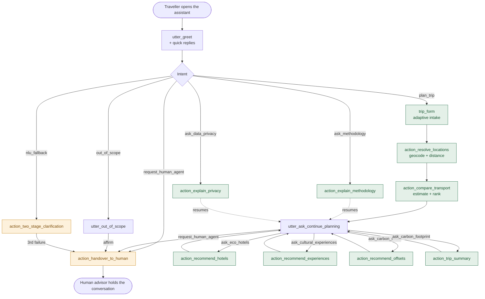
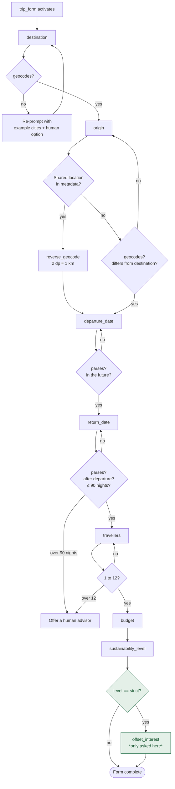
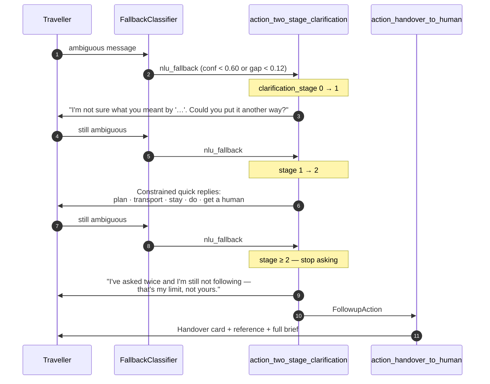
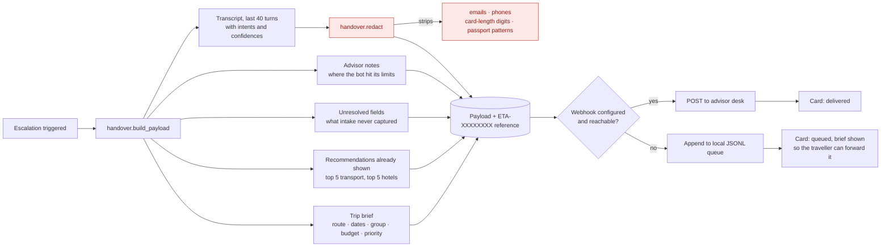

# Conversation flows and interaction design

Mermaid diagrams render directly on GitHub, so these stay in version control with the code
they describe rather than drifting in a separate design tool. Screenshot them for the
report if you need images.

---

## 1. Top-level dialogue architecture

Two things this diagram is meant to make obvious. First, `request_human_agent` is reachable
from every state, including mid-form — it is a rule, not a story, so no policy can decline
it. Second, transparency (`ask_methodology`, `ask_data_privacy`) is also reachable from
everywhere and returns the traveller to exactly where they were. An assistant that can only
justify itself at the end is not auditable during the decision.

---

## 2. Adaptive intake

`offset_interest` is declared in the domain so Rasa can validate its mapping conditions, but
`ValidateTripForm.required_slots` **removes** it unless the traveller chose the strict
profile. Everyone else never sees the question. That is the adaptive-questioning mechanism:
the form's shape is a function of the answers already given, not a fixed script.

Every validator that rejects an answer re-prompts with a worked example, and the two that
detect a request outside the assistant's competence — a trip over 90 nights, a group over
twelve — offer a human immediately instead of continuing to collect data it cannot use.

---

## 3. Error recovery: two stages, then escalate

The escalation on the third failure is issued as a `FollowupAction` from inside the action,
not predicted by a policy. That is deliberate: modelling it as a story would contradict the
`nlu_fallback` rule, which correctly predicts `action_listen` after every clarification
turn. `tests/test_stories.yml` covers the behaviour instead.

The design choice underneath: a bot that re-prompts indefinitely is worse than one that
admits defeat. Two attempts, then a person.

---

## 4. Human handover payload

The advisor notes are the part that matters in practice. They say *why* the bot gave up —
"intake incomplete, still missing origin", "traveller asked for the strictest profile but
the best option is still a flight", "no option came in under the stated budget" — so the
advisor starts from the bot's reasoning rather than from a raw transcript.

Nothing is ever lost: if the webhook is down the payload lands in a local queue and the
traveller is shown their brief so they can forward it themselves.

---

## 5. Interface elements

Mapped to the concrete UI requirements in section 3 of the brief.

| Requirement | Implementation | File |
|---|---|---|
| Quick-reply buttons for destination and preference selection | `buttons` on Rasa responses, rendered as pill buttons; disabled while a request is in flight | `App.tsx` |
| Carousels displaying eco-friendly hotels | Horizontal scroll-snap region, keyboard-reachable, `role="group"` with a described scroll axis | `Cards.tsx` |
| Colour-coded result cards (green / amber / red) | `band` on every option drives a left border, badge and bar | `Cards.tsx`, `styles.css` |
| Alert messages highlighting high-emission options | `type: "alert"` payload, `role="alert"` for warnings | `Cards.tsx` |
| Clear indications of human handover | Handover card **and** a persistent banner that stays visible after the message scrolls away | `App.tsx` |
| Location input via GPS or typing | "Use my location" quick reply; coordinates rounded in the browser before sending | `rasa.ts` |
| Alternative interaction modes (optional) | Web Speech API dictation, progressively enhanced — the button only appears where supported | `App.tsx` |

### Accessibility

Colour is never the only carrier of meaning. Every band shows a colour, a word
("Low emissions") and a glyph, which is what keeps the ranking readable for the roughly one
in twelve men with a colour-vision deficiency — a group large enough that a
sustainability tool relying on green-versus-red would fail a meaningful share of its users.

- Each transport option carries an `aria-label` that reads as one complete sentence, because
  a screen-reader user gets no help from column alignment or a bar chart.
- The transcript is a `role="log"` with `aria-live="polite"`: new messages are announced
  without stealing focus mid-typing.
- Every interactive target is at least 44 × 44 CSS px.
- Focus is always visible; a skip link jumps past the transcript to the message box.
- All animation is suppressed under `prefers-reduced-motion`.
- Both themes were checked for 4.5:1 body-text contrast, 3:1 for large numerals.

### Cognitive load

The intake asks one question per turn, with quick replies wherever the answer space is
closed. Recommendation cards lead with the single number that matters — kilograms of CO₂e —
and put cost, time and distance on a secondary line. Every card explains its own ranking in
one sentence, so the traveller never has to take "this is greenest" on trust.
